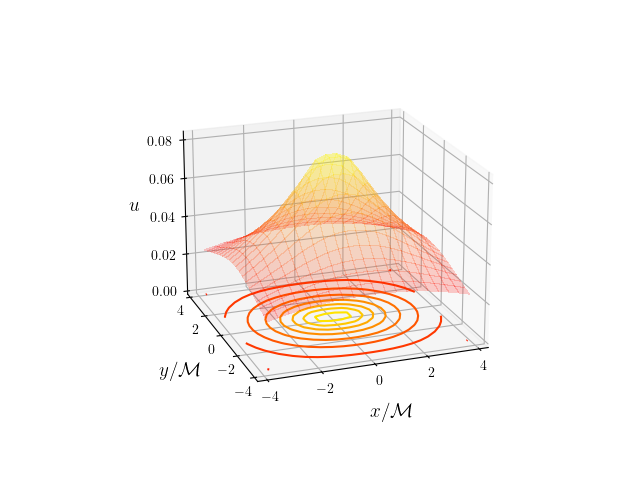

# Numerical Simulation Black Hole

## Overview

This is an attempt at modelling initial data and the associated extrinsic curvature of a black hole with linear momentum. The associated extrinsic curvature is calculated in close proximity to the equatorial plane of the black hole.

## Usage

The script `simulation.py` makes use of the puncture method as described in to construct initial data describing black holes. The environment used for this code can be easily set up using the `anaconda-project.yml` file.
The script will will produce a file called `simulation_data_{grid_dim}_{x_boundary}.data`.

The data file contains values of the function u dependent on x and y on a plane of constant z in close proximity to the equatorial plane.

Once the data has been constructed using `simulation.py` we can make use of `plot_simulation.py` for visualization.

Below is an example of initial data of a black hole with dimensionless linear momentum P = (1,0,0) located at the origin.

## Packages

Please see `anaconda-project.yml` for environment dependencies and package versions

- `python 3.95`
- `numpy 1.20.2`
- `scipy 1.6.2`
- `matplotlib 3.3.4`

## Features

- Constructs initial data for a black hole with linear momentum using the puncture method
- Configurable boundary and number of grid points used in simulation
- Configurable linear momentum and location of the black hole
- `elliptic_solver.py` interface with `scipy.la` for solving constraint equations

## Future Work

- Generalize this approach to the moving puncture method to model binary neutron star precession
- Add a Graphical User Interface for easier manipulation of parameters

## References
