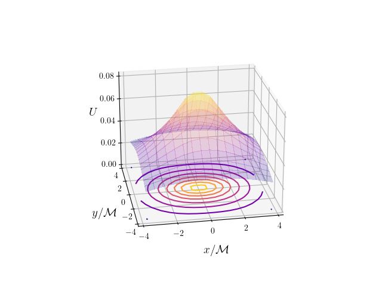

# Numerical Simulation Black Hole

## Summary

This is an attempt at modelling initial data and associated conformal deviation of spatial hypersurfaces around a black hole by solving the Hamiltonian constraint of the decomposed Einstein field equations. By calculating the extrinsic curvature of the general spacetime slices/hypersurfaces we can fully describe the initial data of the black hole. The approach is based on the puncture method for solving the conformally decomposed Hamiltonian constraint equation for the gravitational field outlined in _Shibata_ [2].


Image credit : [NASA](https://www.nasa.gov/feature/goddard/2019/nasa-visualization-shows-a-black-hole-s-warped-world/)

### Detailed Theory Notes

**Please see** [numerical_relativity_theory_notes.pdf](numerical_relativity_theory_notes.pdf) included in this repository for a detailed explanation of:

- Decompostion of Einstein's field equations into constraint and evolution equations using 3+1 decomposition
- Puncture method for solving the constraint equation

For pedagogical purposes a explanation of the 3+1 decomposition of Maxwell's
equations are included as a stepping stone to understanding the more difficult decomposition in general relativity.

NOTE: Please be aware that the notes and theory behind this decomposition assumes a postgraduate familiarity with general relativity.

## Methodology Overview

This approach recasts Einstein's field equations using the well known 3+1 decomposition of spacetime. This decomposition splits the gravitational field equations into constraint and evolution equations. The constraint equations are crucial for imposing conditions on the gravitational fields at any moment in time.

The approach begins with constructing the purely spatial equivalents of the fundamental spacetime objects in general relativity such as the metric tensor, Riemann tensor and the covariant derivative. By taking projections of Einstein's field equations and identifying the spatial cousins of the aforementioned fundamental objects we arrive at the famous ADM equations (named for its authors Richard Arnowitt, Stanley Deser and Charles W. Misner).

The Einstein field equations in 4D spacetime in natural units are:

<a href="https://www.codecogs.com/eqnedit.php?latex=\dpi{150}&space;\bg_white&space;\large&space;R_{\mu\nu}&space;-&space;\frac{1}{2}&space;R&space;=&space;8&space;\pi&space;T_{\mu\nu}" target="_blank"></a>

The ADM 3+1 decomposition is given by:

<a href="https://www.codecogs.com/eqnedit.php?latex=\bg_white&space;\textbf{ADM&space;Decomposition&space;of&space;Einstein&space;Field&space;Equations}&space;\newline&space;\newline&space;\text{Evolution&space;Equations}&space;\newline&space;\begin{align*}&space;\partial_t&space;\gamma_{ij}&space;&=&space;-2\alpha&space;K_{ij}&space;&plus;&space;\mathfrak{L}_{\beta}\gamma_{ij}&space;\\&space;\partial_t&space;K_{ij}&space;&=&space;\alpha&space;(R_{ij}&space;-&space;2K_{ik}K^{k}_{j}&space;&plus;&space;KK_{ij})&space;-&space;D_i&space;D_j&space;\alpha&space;&plus;&space;4\pi&space;\alpha&space;M_{ij}&space;&plus;&space;\mathfrak{L}_{\beta}K_{ij}&space;\end{align*}&space;\newline&space;\text{Constraint&space;Equations}&space;\newline&space;\begin{align*}&space;R&space;&plus;&space;K^{2}&space;-&space;K_{ij}K^{ij}&space;&=&space;16\pi\rho&space;\hspace{1cm}&space;\text{Hamiltonian&space;Constraint}\\&space;D_j(K^{ij}&space;-&space;\gamma^{ij}K)&=&space;8\pi&space;j_{i}&space;\hspace{1cm}&space;\text{Momentum&space;Constraint}&space;\end{align*}" target="_blank"></a>

**Please see** [numerical_relativity_theory_notes.pdf](numerical_relativity_theory_notes.pdf) for full explanation

By the use of a conformal decomposition of the the constraint equations we can describe the initial gravitational field of the black hole using the puncture method. The key insight of the puncture method is that close to the puncture/singularity the spatial laplacian vanishes because the conformal factor supresses the divergent terms. Ultimately this conformal decomposition allows us to solve the non-linear elliptic puncture equation below (which is a transmutated version of the Hamiltonian constraint) which can be achieved with standard numerical techniques:

<a href="https://www.codecogs.com/eqnedit.php?latex=\dpi{150}&space;\bg_white&space;\large&space;\overline{D}^{2}u&space;=&space;-\beta(\alpha&space;&plus;&space;\alpha&space;u&space;&plus;&space;1)^{-7}" target="_blank"></a>

Once we have the solution of this non-linear elliptic equation we can use it to find the conformal factor and extrinsic curvature using:

<a href="https://www.codecogs.com/eqnedit.php?latex=\bg_white&space;\textbf{Conformal&space;factor&space;and&space;relation&space;to&space;elliptic&space;equation}&space;\newline&space;\begin{align*}&space;\psi&space;&=&space;1&space;&plus;&space;\frac{1}{\alpha}&space;&plus;&space;u&space;\hspace{1cm}&space;\text{Conformal&space;factor}\\&space;\frac{1}{\alpha}&space;&=&space;\sum_{n}&space;\frac{\mathfrak{M}_n}{2s_n}&space;\hspace{1cm}&space;\text{Summation&space;of&space;black&space;hole&space;contributions&space;with&space;puncture&space;masses}&space;\end{align*}&space;\newline&space;\text{Where}&space;\hspace{0.1cm}&space;s_n&space;\hspace{0.1cm}&space;\text{is&space;the&space;coordinate&space;distance&space;from&space;the&space;nth&space;black&space;hole}" target="_blank"></a>

Note that this method is generalizable to model the initial data of multiple black holes with both linear and angular momentum, this is because of the resulting linearity of the decoupled constraint equations. This means we can model solutions for spacetimes more general then that described by the Schwarzschild metric; such as those in which black holes have angular and linear momentum. Despite the fact that this approach is valid for these more general solutions, we have not yet incorporated the angular momentum of the black hole in the simulation. The code presented in this repository solves the constraint equations for initial data using the puncture method for black holes with _linear momentum_. Note it should also be elucidated that this a vacuum solution as we assume the energy momentum tensor is zero in the region outside of the black hole.

**Please see** [numerical_relativity_theory_notes.pdf](numerical_relativity_theory_notes.pdf) for a comprehensive explanation of the decomposition of spacetime and puncture method for solving the constraint equations

## Motivation

This project was an attempt to make use of the understanding gained in recent self-directed study of general relativity, tensor calculus and differential geometry.

## Usage

The script `simulation.py` solves the constraint equation by making use of the puncture method as described in _Shibata_ [2], to construct initial data describing the conformal deviation of spacetime on the equatorial plane of a black hole. `simulation.py` has a number of flags that can be used to customize the output of the script:

### `simulation.py flags`

```
-grid_dim (grid points in each dimensions)
-boundary (location of outer boundary)
-loc_x (x coordinate of black hole)
-loc_y (y coordinate of black hole)
-loc_z (z coordinate of black hole)
-p_x (x momentum of black hole)
-p_y (y momentum of black hole)
-p_z (z momentum of black hole)
-tol (tolerance for elliptic solver)
-it_max (maximum number of iterations)
```

The environment used for this code can be easily set up using the `anaconda-project.yml` file.
The script will will produce a file called `simulation_data_{grid_dim}_{x_boundary}.data`.

The data file contains values of the function u dependent on x and y on a plane of constant z in close proximity to the equatorial plane.

Once the data has been constructed using `simulation.py` we can make use of `plot_simulation.py` for visualization.

### `plot_simulation.py flags`

```
-data (puncture data filename)
-save (save filename for image)
```

### Example simulation output

Below is an example of initial data of a black hole with dimensionless linear momentum _P = (1,0,0)_ located at the origin. _u_ is the correction of the Schwarzschild conformal factor. Since we have _u_, by solving the non-linear elliptic version of the hamiltonian constraint equation; we can solve for the conformal factor and the extrinsic curvature of the hypersurface and fully solve the initial data of the black hole.



Note that _M_ as shown in the graph above is the _puncture mass_ which dominates the conformal factor close to the black hole's center. We use the _puncture mass_ to make all variables such as coordinate position and momentum dimensionless.

## Packages

Please see `anaconda-project.yml` for environment dependencies and package versions

- `python 3.95`
- `numpy 1.20.2`
- `scipy 1.6.2`
- `matplotlib 3.3.4`

## Features

- Solves the constraint equation and constructs initial data for a black hole with linear momentum using the puncture method
- Configurable boundary and number of grid points used in simulation
- Configurable linear momentum and location of the black hole
- `elliptic_solver.py` interface with `scipy.la` for solving constraint equations

## Future Work

- Generalize code to account for black holes with angular momentum
- Work on **incorporating the initial data in the evolution equations**
- Generalize this approach to the moving puncture method to model binary neutron star precession
- Add a Graphical User Interface for easier manipulation of parameters

## Non-Exhaustive References

### Numerical Relativity

[1] E. Gourgoulhon, _3+1 formalism in general relativity_. Heidelberg: Springer, 2012.

[2] M. Shibata, _Numerical relativity_. Singapore: World Scientific Publishing Co. Pte. Ltd., 2016.

[3] T. Baumgarte and S. Shapiro, _Numerical relativity_. Cambridge: Cambridge University Press, 2010.

### General Relativity and Differential Geometry

[4] B. Schutz, _A first course in general relativity_. Cambridge [etc.]: Cambridge University Press, 2018.

[5] C. Misner, K. Thorne and J. Wheeler, _Gravitation_. New York: Freeman, 1995.

[6] S. Chandrasekhar, _The mathematical theory of black holes_. Oxford u.a.: Clarendon Press, 1992.

[7] D. Neuenschwander, _Tensor calculus for physics_. John Hopkins University Press, 2015.

[8] S. Carroll, _Spacetime and geometry_. Harlow: Pearson, 2014.

[9] N. Straumann, _General relativity_. Heidelberg: Springer, 2013.

[10] J. Hubbard and B. Hubbard, _Vector calculus, linear algebra, and differential forms_, 5th ed. New York: Matrix Editions, 2015.
